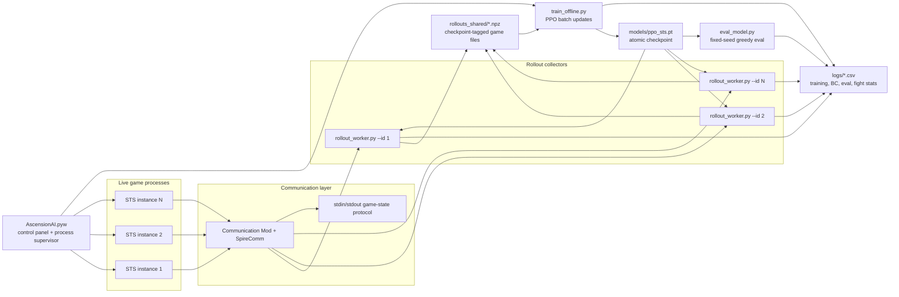

# AscensionAI Architecture

AscensionAI is a distributed reinforcement-learning system. It does not expose the live game as a hosted service; it coordinates several Slay the Spire processes, a Communication Mod bridge, rollout collectors, and an offline PPO trainer through files and checkpoints. The same topology runs two ways: on a local Windows desktop under the GUI control panel, and **headless on a GPU-less Linux cloud VM** for unattended long runs (see [Headless Cloud Deployment](#headless-cloud-deployment-gcp)).

## Topology

## Systems-Engineering Details

| Component | Responsibility |
|---|---|
| Slay the Spire instances | Real game simulation. Each process runs the same mod stack and exposes game state through Communication Mod. |
| Communication Mod bridge | Converts the live game loop into a stdin/stdout protocol that Python can read and command. |
| Rollout workers | Load the current policy, play complete games, write `.npz` rollouts, and periodically reload checkpoints. |
| Shared rollout directory | Local file queue. Each file is a self-contained game trajectory with worker and checkpoint metadata. |
| Offline trainer | Batches fresh rollout files, rejects stale or legacy data, applies PPO updates, and atomically saves the shared checkpoint. |
| Checkpoint sync | Workers reload `models/ppo_sts.pt` on an interval so rollout data stays close to the trainer's current policy. |
| Evaluation harness | Runs heuristic or model policies against deterministic seed sets and writes comparable CSV metrics. |
| Control panel | Launches modes, starts/stops game processes, tails logs, recommends worker counts, and cleans up orphaned processes. |

## Failure Handling

| Failure mode | Handling |
|---|---|
| Game process exits | The launcher tracks process IDs and can relaunch workers through ModTheSpire. |
| Detached JVM remains alive | Stop actions sweep for orphaned Slay the Spire Java processes. |
| Worker lags trainer | Rollout metadata records checkpoint IDs; the trainer rejects rollouts beyond `--max-rollout-lag`. |
| Legacy rollout lacks metadata | Rejected by default unless `--allow-legacy-rollouts` is explicitly set. |
| Invalid or stuck screen state | Shared screen handler uses conservative proceed/choice recovery and logs command errors. |
| Interrupted BC collection | Per-game BC progress checkpoints allow restart without losing completed demonstrations. |

## Scaling Points

The current implementation uses a local filesystem queue because the bottleneck is live game simulation, not network transport. The architecture maps cleanly to a larger deployment:

| Local component | Cloud/distributed analogue |
|---|---|
| `rollouts_shared/*.npz` | Object storage bucket or durable queue |
| `models/ppo_sts.pt` | Versioned model registry artifact |
| Worker IDs | Container/task IDs |
| Stale rollout checks | Policy-version validation at ingest |
| Control panel | Job launcher and log viewer |
| CSV logs | Metrics sink or experiment tracker |

The public dashboard and experiment reports are intentionally deployable without the game dependency. A reviewer can inspect the architecture, results, and training loop without installing Slay the Spire.

## Headless Cloud Deployment (GCP)

The local-vs-cloud distinction in the table above is no longer hypothetical. The full worker + trainer loop runs **headless on a GCP `c3-standard-22` spot VM** (22 vCPU, 88 GB RAM, no GPU, no display). The `vm/` directory holds a one-shot installer (`vm/install.sh`), a worker/trainer launcher (`vm/run_training.sh`), a headless eval runner, and push/pull sync helpers. A single command on a fresh Ubuntu image provisions Java 8, Xvfb, OpenAL, a Python venv with CPU PyTorch, and the directory layout; a second command launches 8 workers plus the offline trainer.

The cloud path keeps the same file-queue architecture (per-game `.npz` rollouts → offline PPO → atomic checkpoint → worker reload). What changed is the *operational* layer: running a GUI-bound, mod-loaded desktop game many times over on a server with no graphics stack.

### Headless reliability challenges

| Challenge | Root cause | Handling |
|---|---|---|
| No GPU / no display | LWJGL needs an OpenGL context | Per-worker **Xvfb** virtual display + software GL (`LIBGL_ALWAYS_SOFTWARE`, `allowSoftwareOpenGL`). |
| ~100× slowdown with multiple instances | OpenGL serializes across windows on a shared X server | Give **each worker its own Xvfb display** (`:99+id`). |
| Intermittent SIGSEGV at startup | LWJGL native-library extraction races when JVMs share a tmpdir | Per-worker `-Djava.io.tmpdir`. |
| Mods silently don't load | ModTheSpire/BaseMod break on the Java 17+ module model | Pin **Java 8** via `update-alternatives`. |
| Startup crash on audio init | `libopenal.so.1` missing on a headless image | Install `libopenal1`, point LWJGL at it explicitly. |
| Worker killed ~10 s after launch | CommunicationMod's READY handshake times out; `import torch` is slower than 10 s | Emit `ready` on stdout **before** any heavy import. |
| Silent worker death after ~35 games | JVM heap (512 MB) OOMs over a long session | `-Xmx2048m` + restart every 25 games. |
| Shared CommunicationMod config | The mod ignores `XDG_CONFIG_HOME`; all workers read one file | Default `--id` to PID so per-process artifacts stay isolated. |
| Spot preemption | GCP reclaims the VM | `--instance-termination-action=STOP` preserves the disk; a watcher restarts training on the next boot. |

### Throughput and sizing

Each STS instance is CPU-bound at roughly 2 vCPU for the game loop plus ~0.7 vCPU for the Python policy/IO bridge — there is no effective frame limiter under software GL. On 22 vCPUs, 8 concurrent workers saturate the machine without thrashing and sustain ~90+ games/hour once heap-stable. Adding workers past that point only trades per-game speed for parallelism. Spot pricing (~$0.19/hr) makes a 12-hour unattended run cost a few dollars.
