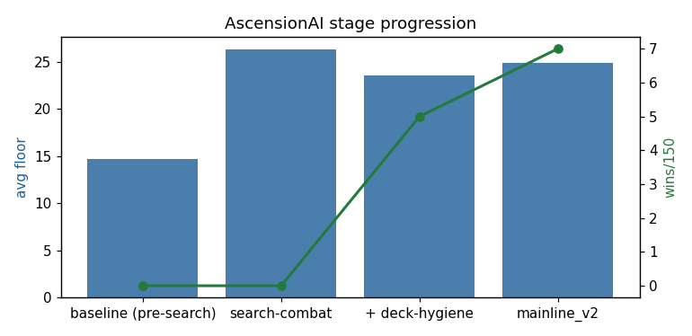
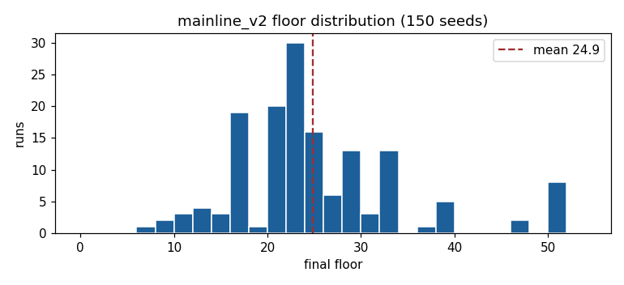
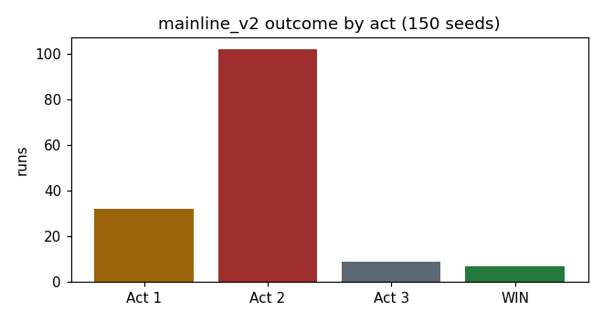

# 010 First Winning Agent — Search-Combat to mainline_v2

**Dates:** 2026-06-13 → 2026-06-15
**Result:** **mainline_v2 — avg floor 24.9, 7 wins / 150 fixed seeds (4.7%)** — the first agent in the project's history to *complete* runs, after ~21,700 live games and the entire simulator variant series at 0 wins.

---

## Summary

Experiment 009 established that **combat execution** was the universal ~14.7-floor plateau, and that a 1-ply look-ahead **search** plays combat far better than any learned feed-forward policy could. This report covers turning that breakthrough into a *winning* full-run agent through a disciplined, diagnose-first sequence of macro (non-combat) levers — each one measured, A/B-tested at 150-seed statistical power, and either deployed or ruled out.

## Stage progression (fixed eval seeds)

| stage | avg floor | wins | seeds |
|---|---|---|---|
| baseline (pre-search) | 14.7 | 0 | 48 |
| search-combat | 26.4 | 0 | 48 |
| + deck-hygiene | 23.6 | 5 | 150 |
| **mainline_v2** | **24.9** | **7** | 150 |

Note the non-monotonic floor: **search-combat maximized depth** (14.7→26.4) but won nothing; **deck-hygiene traded some depth for the first wins** (lean decks snowball or fizzle); then the stacked levers **recovered depth while pushing wins to 7**.

## The causal ledger

Every change was diagnosed *before* it was built, then attributed at 150-seed power:

| observation | lever | result |
|---|---|---|
| combat is the wall (floor 14.7→26.4 from combat alone) | search-combat | ✅ deployed |
| deck bloat (29 cards, ~10 un-removed basics, 0 relics) | deck hygiene (remove + skip filler + suppress shop bloat) | ✅ first wins (0→5) |
| combat falls off a cliff in Act 2 (elite 95%→59%, monster 99%→87%) | varN combat retrain on harvested Act-2/3 fights | ✅ deployed (Act-2 elites, depth) |
| 42% of Act-2 decks have ZERO AoE; 34% no draw | narrow AoE/draw role scorer (gap-filler only) | ✅ deployed (gaps 38%→8%, floor +0.7) |
| 0.9 upgrades at Act-2 entry (upgrade starvation) | conservative boss-aware smith (HP≥85%, ≥95% pre-boss) | ✅ deployed (upgrades→1.9, no HP cost) |
| 8 starters at Act-2 entry | starter-purge | ❌ ruled out (no "fewer→better" relationship; sweet spot is ~8) |
| hoarded gold, 0 relics | relic buying | ❌ neutral at 150-seed power |
| HP not the limiter (boss-entry HP 88%) | elite/path gating | ❌ no-op |
| upgrade starvation (first attempt) | naive "smith when safe" (bar 0.55) | ❌ regressed (tanked boss-entry HP) |

The decisive methodological lesson: **levers that followed diagnose→target→A/B stacked (~+0.3–0.7 floor, +1 win each); levers that skipped diagnosis or were too broad washed out.**

## mainline_v2 — deployed config

- **Combat:** 1-ply replay search (rollout teacher), net `policy_varN.npz` (trained on Act-1 + harvested Act-2/3 fights).
- **Non-combat:** deck-hygiene macro (`policy_varE.npz` base) + AoE/draw role scorer + conservative boss-aware smith.
- **Toggles:** `GATE_ELITES=0`, `RELIC_BUY=0`, `ROLE_SCORE=1`, `SMITH=1`, `COMBAT_NPZ=policy_varN.npz`.
- **Reproduce:** `bash eval_stages.sh 150`. **Rollbacks:** `eval_mainline_v1.py`, `policy_varL.npz`.

## Conclusion & next phase

The blunt macro lever is at its ceiling — the last cheap heuristic (starter-purge) was ruled out by diagnostic, and the remaining wall is unchanged: **Act-2 monsters, dying with the enemy at ~50% HP.** That is combat *throughput*, not card drafting.

The next large jump is therefore a **combat/search v2 phase**, not another heuristic: deeper search in high-risk states (2-ply / averaged rollouts), a stronger combat value model, or a longer/deeper varN-style retrain. That is a deliberate new phase; mainline_v2 stands as a strong, fully reproducible checkpoint and the project's first winning agent.
