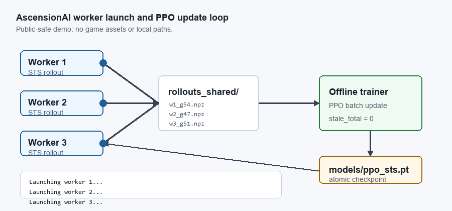

# AscensionAI Portfolio Page

AscensionAI is a local distributed reinforcement-learning system for Slay the Spire. It combines behavior-cloning warm starts, PPO fine-tuning, a 134-action masked discrete action space, parallel rollout workers, checkpoint-aware offline training, deterministic fixed-seed evaluation, and a Windows control panel for long-running run supervision.

## What Makes It Non-Trivial

| Area | Implementation |
|---|---|
| ML training | Behavior cloning, PPO, GAE, entropy control, target-KL early stopping, BC anchor loss. |
| Environment integration | Live Slay the Spire process controlled through ModTheSpire, Communication Mod, and SpireComm. |
| Action safety | 134 discrete actions masked per game state so illegal commands are not sampled. |
| Distributed systems | N game workers write checkpoint-tagged rollouts; one trainer consumes fresh files and rejects stale data. |
| Evaluation | Heuristic, BC, and PPO policies run on the same deterministic seed file with comparable CSV metrics. |
| Tooling | Desktop control panel launches workers, tails logs, recommends worker counts, and cleans up orphaned processes. |
| Cloud / DevOps | One-shot installer deploys the whole stack **headless on a GPU-less GCP spot VM**; 8 game instances run under per-worker Xvfb displays with software OpenGL, surviving spot preemption. |

## Headless Cloud Deployment

The training loop also runs unattended on a **GCP `c3-standard-22` spot VM** (22 vCPU, no GPU, no display). A single idempotent installer (`vm/install.sh`) provisions Java 8, Xvfb, OpenAL, and a CPU PyTorch venv; one launcher (`vm/run_training.sh`) brings up 8 headless workers plus the offline trainer at ~90+ games/hour.

Making a GUI-bound, mod-loaded desktop game run many times over on a headless server required solving a chain of non-obvious failures: giving each worker its **own Xvfb display** (a shared display ran ~100× slower because OpenGL serializes across windows) and its **own JVM tmpdir** (shared `/tmp` caused LWJGL native-extraction SIGSEGV races), pinning **Java 8** (mods silently fail to load on 17+), wiring up headless **OpenAL**, signaling CommunicationMod's READY handshake **before** the slow `import torch` (its timeout is 10 s), and fixing a silent JVM heap OOM that had been killing workers after ~35 games (a 2 GB heap + 25-game restart lifted throughput from ~55 to ~90+ games/hour). Spot preemption is handled by `STOP`-on-preempt (disk preserved) plus an auto-restart monitor.

## Public Demo

| Asset | Preview |
|---|---|
| Control panel and log supervision |  |
| Worker/trainer loop GIF |  |
| Training plot snapshot |  |

Open the [static results dashboard](dashboard/index.html) to inspect the embedded public snapshot or load local CSV files from a fresh run.

## Current Results

| Policy | Games | Avg floor | Avg reward | Win rate | Act 2 reach | Floor 20+ |
|---|---:|---:|---:|---:|---:|---:|
| Heuristic | 150 | 15.78 | 8.44 | 0.0% | 26.0% | 23.3% |
| BC checkpoint | 150 | 12.81 | -0.55 | 0.0% | 12.0% | 12.0% |
| PPO checkpoint | 150 | 14.70 | 2.37 | 0.0% | 18.7% | 18.0% |

The project is presented honestly: the current PPO checkpoint beats the BC checkpoint on the wider eval, but remains behind the heuristic baseline and has not yet recorded a full win. The engineering value is in the complete training system, deterministic evaluation harness, dashboard, and reproducible reporting pipeline that make future improvements measurable.

## Links

- [Experiment reports](experiments/)
- [Architecture documentation](architecture.md)
- [Technical writeup](AscensionAI_Technical_Writeup.md)
- [Resume bullets and summary](resume_portfolio.md)
