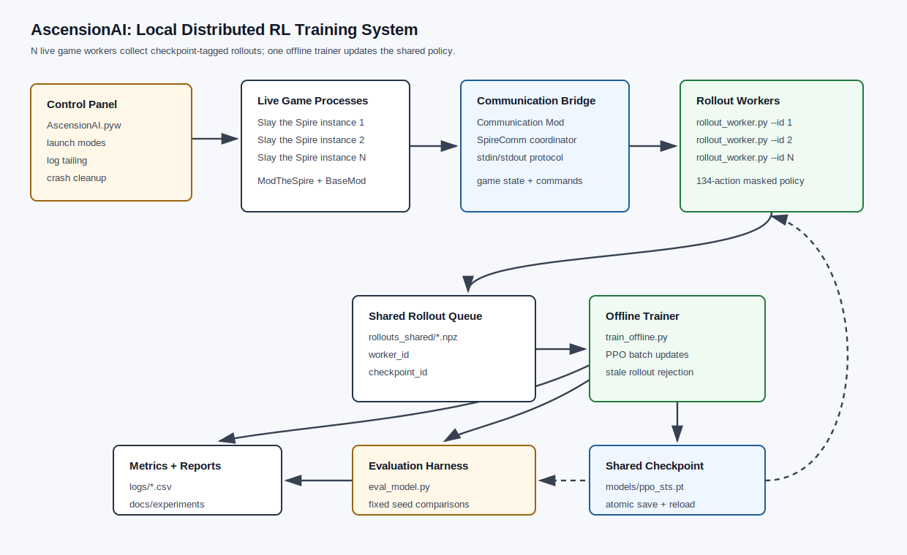
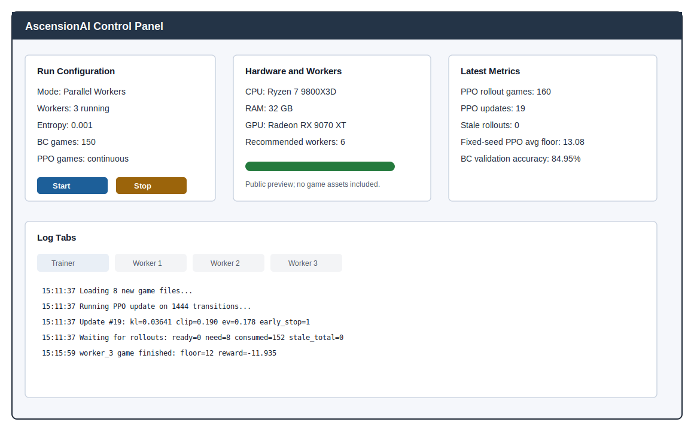
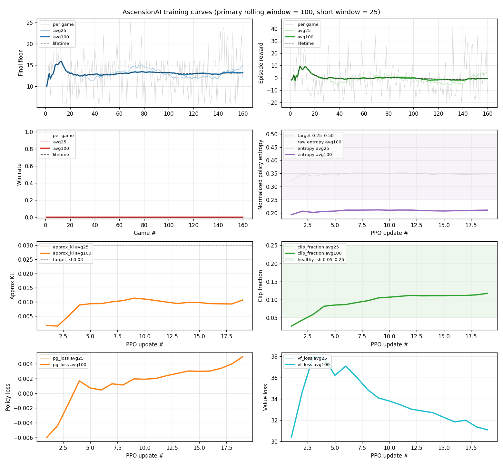

# AscensionAI Portfolio Page

AscensionAI is a local distributed reinforcement-learning system for Slay the Spire. It combines behavior-cloning warm starts, PPO fine-tuning, a 134-action masked discrete action space, parallel rollout workers, checkpoint-aware offline training, deterministic fixed-seed evaluation, and a Windows control panel for long-running run supervision.

## What Makes It Non-Trivial

| Area | Implementation |
|---|---|
| ML training | Behavior cloning, PPO, GAE, entropy control, target-KL early stopping, BC anchor loss. |
| Environment integration | Live Slay the Spire process controlled through ModTheSpire, Communication Mod, and SpireComm. |
| Action safety | 134 discrete actions masked per game state so illegal commands are not sampled. |
| Distributed systems | N game workers write checkpoint-tagged rollouts; one trainer consumes fresh files and rejects stale data. |
| Evaluation | Heuristic, BC, and PPO policies run on the same deterministic seed file with comparable CSV metrics. |
| Tooling | Desktop control panel launches workers, tails logs, recommends worker counts, and cleans up orphaned processes. |

## Public Demo

| Asset | Preview |
|---|---|
| Control panel and log supervision |  |
| Worker/trainer loop animation |  |
| Training plot snapshot |  |

Open the [static results dashboard](dashboard/index.html) to inspect the embedded public snapshot or load local CSV files from a fresh run.

## Current Results

| Policy | Games | Avg floor | Avg reward | Win rate | Act 2 reach | Floor 20+ |
|---|---:|---:|---:|---:|---:|---:|
| Heuristic | 25 | 16.60 | 11.38 | 0.0% | 32.0% | 32.0% |
| BC checkpoint | 25 | 13.08 | -0.62 | 0.0% | 12.0% | 12.0% |
| PPO checkpoint | 25 | 13.08 | -0.62 | 0.0% | 12.0% | 12.0% |

The project is presented honestly: the current PPO checkpoint has not yet beaten the heuristic or BC baseline. The engineering value is in the complete training system, deterministic evaluation harness, dashboard, and reproducible reporting pipeline that make future improvements measurable.

## Links

- [Experiment reports](experiments/)
- [Architecture documentation](architecture.md)
- [Technical writeup](AscensionAI_Technical_Writeup.md)
- [Resume bullets and summary](resume_portfolio.md)
